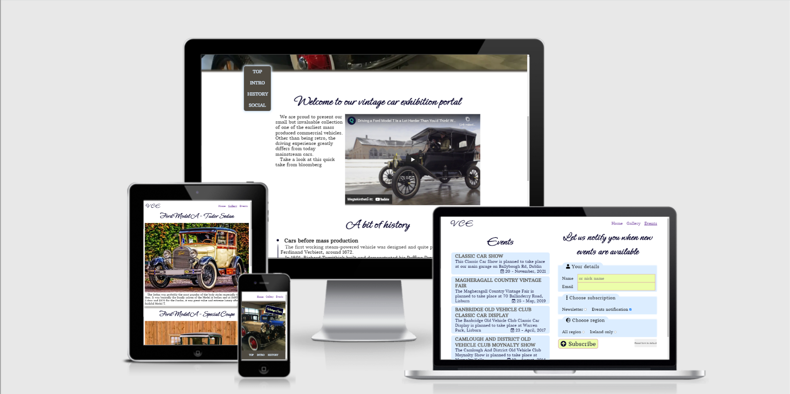
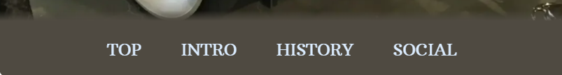
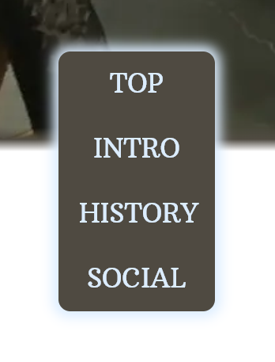
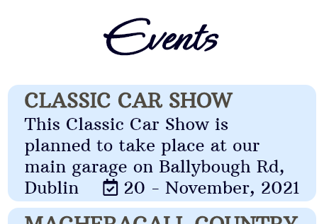
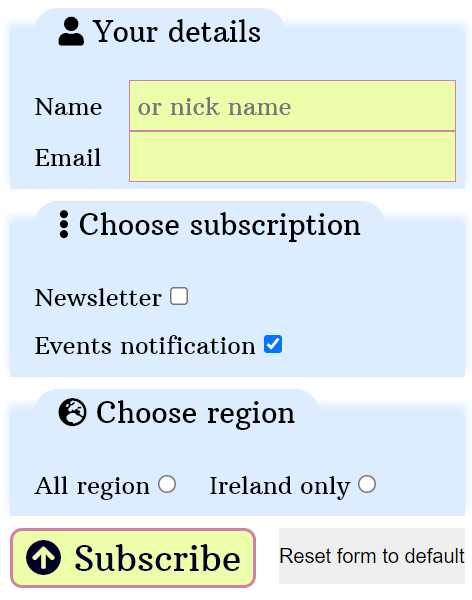

<h1 align="center"> Vintage Car Exhibition </h1>

## Code Institute - Portfolio Project 1 - HTML, CSS

[See the live project here](https://spanifer.github.io/Portfolio-Project-HTML-CSS/)

A website about a discreet collection of vintage cars, a bit of history from the era and similar exhibition events.

# Table of content
+ [User Experience](#user-experience)
+ [Features](#features)
+ [Technologies Used](#technologies-used)
+ [Testing](#testing)
+ [Deployment](#deployment)
+ [Credits](#credits)

***

<h1 id="user-experience">User Experience (UX) - <em>Design Process</em></h2>

- ## Strategy

    - ### Definition

        1. A website about vintage cars, for a wide target audience from *children* to **enthusiast**

        2. The content is minimalists straight to the point historic facts about the first cars, so whoever is interested in that topic should find this site sufficient and informative.

        3. Landing page should have a main image followed by an introductory inviting text to scroll down further and find historical timeline, link to gallery, and to register for upcoming exhibition events.

    - ### Value

        1. It needs to be visually appealing so much so that less interested visitors about the topic gets convinced to explore the site. ~~Expecting the initial short intro animation to excite interest.~~

        2. The site have a subscription page to receive upcoming exhibition information.

        3. A hub for historical information, and short historical introduction within a timeline.

    - ### Focus

        Opportunity / Problem | Importance | Feasibility
        --- | --- | ---
        ~~First impression of intro animation~~ | ~~4~~ | ~~?~~
        ~~HTML-CSS crafted logo~~ | ~~4~~ | ~~?~~
        ~~Member registration~~ | ~~4~~ | ~~3~~
        Upcoming events subscription | 5 | 4
        Gallery page | 3 | 4
        Overall landing page | 5 | 5

- ## Scope
    - ### User Stories
        - First Time Visitor Goals
            1. I am interested in the historic content, and/or the exhibit itself and want to learn more.
            2. I want to be able to easily navigate throughout the site content.
            3. I want to know that the content is true and reliable. I also want to see their social media to determine how trusted and known they are.
        
        - Returning Visitor Goals
            1. I want to quickly find a historic fact on the timeline, or navigate to gallery and/or review future events?
            2. I want to find community links.
            3. I considering subscribing to receive information about upcoming events.
        
        - Frequent User Goals
            1. I want to see if there are any new exhibition event.
            2. If any new pictures added to the gallery.
    
    - ### Implementation priorities
        1. Landing page, with timeline, and content
        2. Subscription form
        3. Gallery page
        4. ~~Intro animation and/or html-crafted logo~~

- ## Structure
    - ### Information architecture
        - User can reach all pages from main header navigation list
        - User can reach major sections within a sticky navigation list
    - ### Interaction design
        - All user action have a clear and visible feedback

- ## Skeleton
    - ### Conventions
        - Calendar icon for the events dates
        - Other conventional icons for the subscription form
    - ### Navigation
        - Main navigation at the top
        - Aside navigation on the home page
    - ### Wireframes
        - [Mobile/Tablet](assets/images/readme/mobile-tablet.png)
        - [Medium Screen](assets/images/readme/medium-screen.png)
        - [Large Screen](assets/images/readme/large-screen.png)

- ## Surface
    - ### Mobile first design approach
    - ### Colour Scheme
        Colours chosen from [coolors.com](https://coolors.co/4f4a41-dcedff-ecfeaa-d282a6-030027)
        - white and black
        - davys-grey: #4f4a41ff
        - alice-blue: #dcedffff
        - key-lime: #ecfeaaff
        - middle-purple: #d282a6ff
        - oxford-blue: #030027ff

    - ### Typography
        - Arbutus Slab font was chosen for the main content and general text, to achieve the atmosphere of the retro cars on display. Inspired by 18th and 19th American jobbing type.
        - Ephesis font was chosen for large headings to reenforce the atmosphere even more.
    - ### Imagery
        - Main image chosen for an instant and inviting look of the cars on display. (Lucky find I must say.)
        - Other images from royalty free image collection sites (see [Credits -> Media](#media))

# Features

- Responsive on all device sizes
- Interactive Elements

- The home page make us of sticky navigation, that starts on the bottom of screen and sticks to the top further down. The element height was chosen after mobile browsers Url height.

- On larger screens it is highlighted to stand out from the similar colored image background. Its position follow the main element on the left side of the page, and make it easy to quickly navigate to major content.

- List of upcoming and previous events.

- Subscription form.

# Technologies used

## Languages used
- [HTML5](https://en.wikipedia.org/wiki/HTML5)
- [CSS3](https://en.wikipedia.org/wiki/Cascading_Style_Sheets)

## Frameworks, Libraries & Programs Used
1. [Git](https://git-scm.com/)
1. [GitHub](https://github.com)
1. [Google Fonts](https://fonts.google.com/)
1. [Font Awesome](https://fontawesome.com/)
1. [Balsamiq](https://balsamiq.com/)
1. [Image average color finder](https://10015.io/tools/image-average-color-finder)
1. To resize and convert images [img2go.com](https://www.img2go.com/resize-image)
1. To reduce image size [tinypng.com](https://tinypng.com/)

# Testing
The W3C Markup Validator and W3C CSS Validator Services were used to validate every page of the project to ensure there were no syntax errors in the project. feature 
- [W3C Markup Validator](https://validator.w3.org/) - [Results](assets/images/readme/w3c-results/)
- [W3C CSS Validator](https://jigsaw.w3.org/) - All Passed Without Errors

## Testing user Stories from [UX Scope](#user-stories)

Users are greeted with an inside look of the exhibition and garage, and with clear main navigation bar they can decide where to go next. The secondary navigation bar can help to easily reach the historic content and social media links next to the address and map.

## Further testing
- Chromes [Screen Reader](https://chrome.google.com/webstore/detail/screen-reader/kgejglhpjiefppelpmljglcjbhoiplfn?hl=en) to test accessibility
- Website was tested on Google Chrome, Mozilla Firefox, Microsoft Edge and Safari browser.
- Website was viewed on many devices such as Desktop, Laptop, iPhone 12, Samsung, and Pixel.
- Friends been asked to review the website and point out any bugs and experience issues.

## Found issues
- CSS property scroll-behavior is [not supported](https://developer.mozilla.org/en-US/docs/Web/CSS/scroll-behavior#browser_compatibility) by the Safari browser, yet tests indicate it does work as expected
- Smooth-scroll for internal links does not scroll to the referenced id if the Screen Reader is enabled

# Deployment

## GitHub Pages

The project was deployed to GitHub Pages using the following steps...

1. Log in to GitHub and locate the [GitHub Repository](https://github.com/)
2. At the top of the Repository, locate the "Settings" Button on the menu.
3. From the vertical navigation list on the left side select the "Pages" link.
4. Under "Source", click the dropdown called "None" and select "Branch: main".
5. The page will automatically refresh.
6. Scroll back down through the page to locate the now published site [link](https://spanifer.github.io/Portfolio-Project-HTML-CSS/) in the "GitHub Pages" section.

# Credits

- ## Code
    - Markdown documentation from [The Markdown Guide](https://www.markdownguide.org/basic-syntax/)
    <!-- https://stackoverflow.com/questions/25706012/how-do-i-prevent-auto-generated-links-in-the-github-wiki#answer-25707855 -->
    - README<area>.md structure inspiration from [CI SampleReadme](https://github.com/Code-Institute-Solutions/SampleREADME/blob/master/README.md)
    - Responsive pixel size on [stackoverflow](https://stackoverflow.com/questions/21574881/responsive-design-with-media-query-screen-size#answer-38037613)
    - At least 5 separate tab of [MDN Web Docs](https://developer.mozilla.org/en-US/) are in constant use
    - [Emmet Cheat Sheet](https://docs.emmet.io/cheat-sheet/)

- ## Content
    - [supercars.net](https://www.supercars.net/blog/early-1900s-cars/)
    - [wikipedia.org](https://en.wikipedia.org/wiki/Car)
    - About [Model A Sedan](https://www.oneillvintageford.co.uk/acatalog/Ford_Model_A_Body_Styles.html) and from [this video](https://www.youtube.com/watch?v=8uljhvXIlQ0)
    - About [Model A Coupe](https://www.jalopyjournal.com/forum/threads/1928-ford-model-a.1086996/)
    - About [Model T Touring](https://youtu.be/6i8-bSaUk_M)
    - Real events from [here](https://www.classiccarevents.uk/listings/upcoming_fortnight.php)

- ## Media
    - On Youtube: [Driving a Ford Model T](https://youtu.be/MLMS_QtKamg)
    - [Pexels](https://www.pexels.com/)
        - [Main Image](https://www.pexels.com/photo/vintage-cars-in-a-well-lighted-room-175568/)
    - [Pixabay](https://www.pixabay.com/)
    - [Unsplash](https://unsplash.com/)
    - Editorial use only [Model T Touring](https://www.rawpixel.com/image/3092643/free-photo-image-car-historical-house)
    - To find matching colors: [Coolors](https://coolors.co/)
    - For contrast comparison: [Contrast Grid](https://contrast-grid.eightshapes.com/?version=1.1.0&background-colors=&foreground-colors=%234f4a41ff%3B%0D%0A%23dcedffff%3B%0D%0A%23ecfeaaff%3B%0D%0A%23d282a6ff%3B%0D%0A%23030027ff%3B%0D%0A%23FFF&es-color-form__tile-size=compact&es-color-form__show-contrast=aaa&es-color-form__show-contrast=aa&es-color-form__show-contrast=aa18&es-color-form__show-contrast=dnp)

- ## Acknowledgements for
    - Everyone on Slack, even tho I did not have many opportunity to take part in conversations, the amount of information that is available to browse is irreplaceable
    - Every session with my mentors, all the tips and clarifications